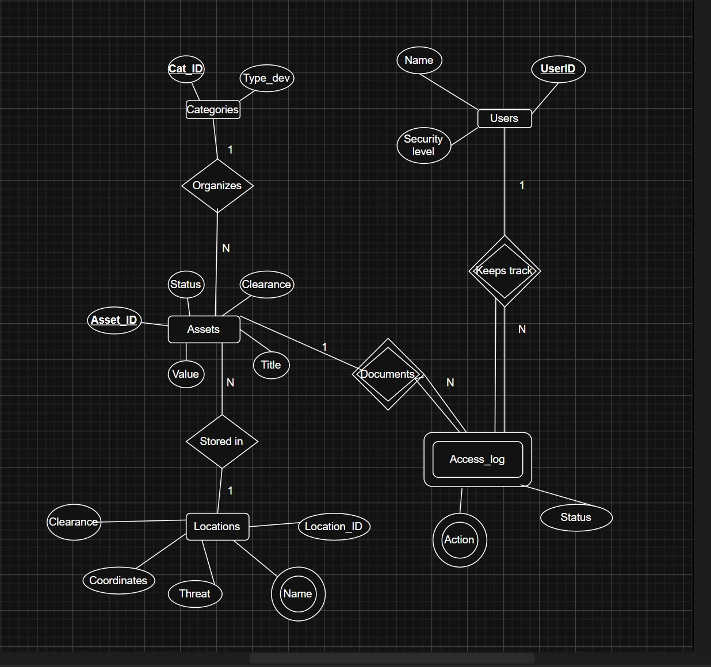

# SQL-Asset-Management-System

Secure Asset Repository (SAR) is a relational database designed to manage high-security assets, users, locations, and categories.  
It tracks user access through an access log, enforces data integrity with foreign keys and constraints, and supports complex queries for analysis and reporting.  
SAR demonstrates best practices in relational database design, secure asset management, and transactional operations.
